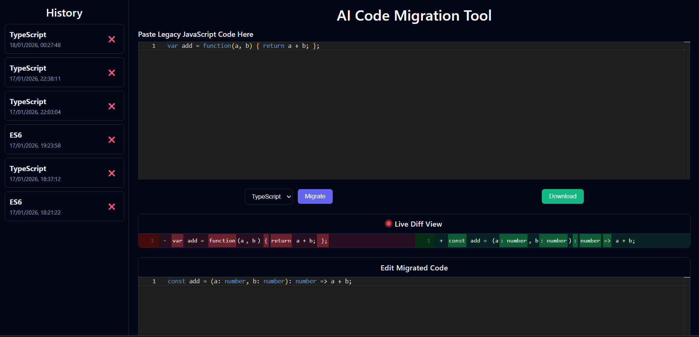

# 🚀 AI-Assisted Code Migration Tool

An AI-powered developer tool that converts **legacy JavaScript code** into **modern ES6+ JavaScript or TypeScript** with strict typing, side-by-side diff comparison, export support, and migration history.



This project demonstrates **full-stack system design**, **AI integration**, and **developer-centric UX**.

---

## ✨ Features

- 🧠 **AI-powered code migration**
  - Legacy JavaScript → ES6+ or TypeScript
  - Strict typing and modern syntax

- 🧑‍💻 **Monaco Editor**
  - VS Code–like editing experience

- 🔍 **Side-by-side diff viewer**
  - Compare original vs migrated code

- **Edit Migrated Code**
  - Edit migrated code and see the live difference

- 💾 **Session history**
  - Stores past migrations using MongoDB

- 📤 **Export & copy**
  - Download migrated code as `.js` or `.ts`

- ⚠️ **Graceful error handling**
  - Clear UI feedback for failures

---

## 🛠️ Tech Stack

### Frontend

- React.js
- Monaco Editor (`@monaco-editor/react`)
- react-diff-viewer
- Axios

### Backend

- Node.js
- Express.js
- MongoDB (Mongoose)
- Gemini API (Google Generative AI)

---

## 🧩 System Architecture

```
Frontend (React)
│
├── Monaco Editor (input)
├── Diff Viewer (comparison)
├── Export / History UI
│
Backend (Node + Express)
│
├── Prompt Builder
├── Gemini AI Integration
├── Migration API
│
Database (MongoDB)
│
└── Migration Sessions
```

---

## 📂 Project Structure

```
AI-CODE-MIGRATION-TOOL/
│
├── client/
│   ├── .env
│   ├── .gitignore
│   ├── package.json
│   ├── package-lock.json
│   ├── node_modules/
│   │
│   ├── public/
│   │   ├── favicon.ico
│   │   ├── index.html
│   │   ├── logo.png
│   │   └── manifest.json
│   │
│   └── src/
│       ├── components/
│       │   ├── CodeEditor.jsx
│       │   ├── DiffViewer.jsx
│       │   ├── EditableMigratedEditor.jsx
│       │   ├── ErrorBanner.jsx
│       │   ├── Home.jsx
│       │   ├── MigrationOptions.jsx
│       │   └── SessionHistory.jsx
│       │
│       ├── services/
│       │   ├── api.js
│       │   └── themeStyles.js
│       │
│       ├── styles/
│       │   ├── Home.css
│       │   └── index.css
│       │
│       ├── utils/
│       │   └── exportFile.js
│       │
│       ├── App.js
│       ├── App.test.js
│       ├── index.js
│       ├── reportWebVitals.js
│       └── setupTests.js
│
├── samples/
│   ├── legacy.js
│   └── migrated.ts
│
├── server/
│   ├── .env
│   ├── .gitignore
│   ├── package.json
│   ├── package-lock.json
│   ├── node_modules/
│   │
│   └── src/
│       ├── controllers/
│       │   └── migration.controller.js
│       │
│       ├── models/
│       │   └── MigrationSession.js
│       │
│       ├── routes/
│       │   └── migration.routes.js
│       │
│       ├── services/
│       │   ├── ai.service.js
│       │   └── prompt.builder.js
│       │
│       └── index.js
│
├── .gitignore
├── package.json
├── package-lock.json
└── README.md
```

---

## ⚙️ Setup Instructions

### 1️⃣ Clone the repository

```bash
git clone https://github.com/your-username/ai-code-migration-tool.git
cd ai-code-migration-tool
```

---

### 2️⃣ Backend Setup

```bash
cd server
npm install
```

Create `.env` file:

```env
PORT=5000
MONGO_URI=your_mongodb_connection_string
GEMINI_API_KEY_2_5_FLASH=your_gemini_api_key
GEMINI_API_KEY_3_FLASH_PREVIEW=your_gemini_api_key_different
```

> **Note:**
> I have used **two Gemini API keys** so that if the token limit of one key is exceeded, the application automatically uses the other.
> You can also use **only one API key**—the application will still work fine in that case.

Run backend:

```bash
npm run dev
```

---

### 3️⃣ Frontend Setup

```bash
cd client
npm install --legacy-peer-deps
```

Create `.env` file:

```env
REACT_APP_BASE_URL=http://localhost:5000
```

Run frontend:

```bash
npm run dev
```

Frontend runs on:

```
http://localhost:3000
```

Backend runs on:

```
http://localhost:5000
```

---

## 🔁 How It Works

1. Paste legacy JavaScript code into the editor
2. Select target format (ES6+ / TypeScript)
3. Click **Migrate**
4. Review AI-generated changes in live diff viewer
5. **Edit(if required)** AI-generated changes in Migrated Code Editer
6. Download or copy migrated code
7. Revisit previous migrations via history panel

---

## 🧠 AI Prompt Strategy

The AI prompt is carefully designed to:

- Preserve business logic
- Avoid hallucinations
- Enforce modern syntax
- Generate strict, compilable TypeScript
- Output **code only** (no explanations)

Prompt logic is modular and reusable.

---

## 📸 Sample Migration

**Legacy JavaScript**

```js
var sum = function (a, b) {
  return a + b;
};
```

**Migrated TypeScript**

```ts
export const sum = (a: number, b: number): number => {
  return a + b;
};
```

---

## 🚀 Future Enhancements

- AST-based validation
- Multi-file migration
- Zip export
- Authentication
- Prompt versioning

---

## 🧑‍💻 Author

**Yogesh Saini**

- Competitive Programmer (Codeforces- **Specialist**, LeetCode- **Knight**)
- Full-Stack & Backend-focused Developer
- Interested in scalable systems and AI-powered developer tools
